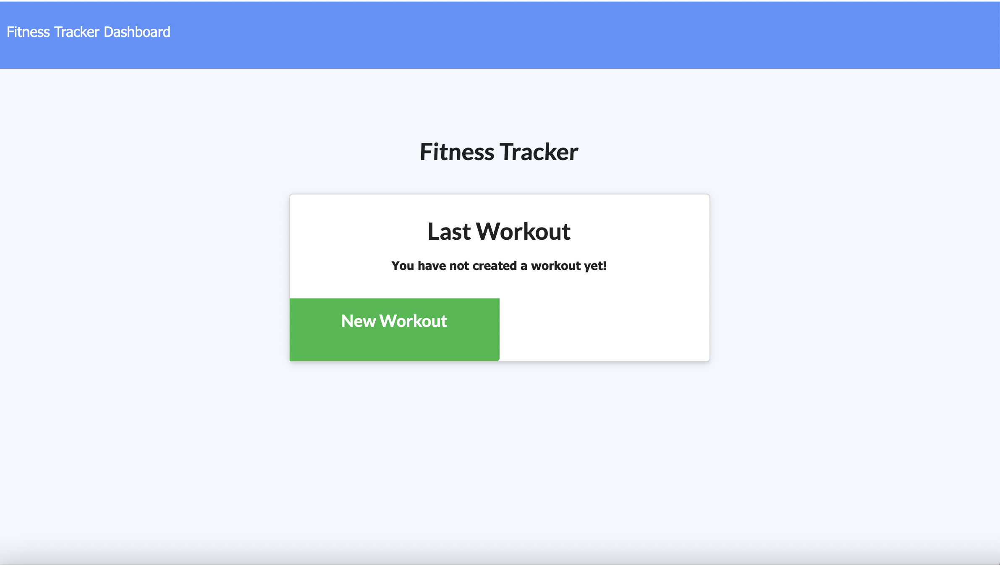
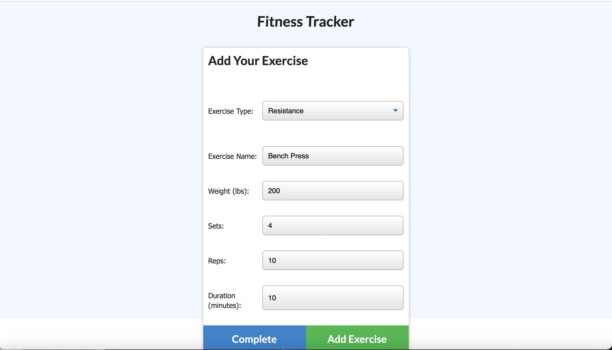
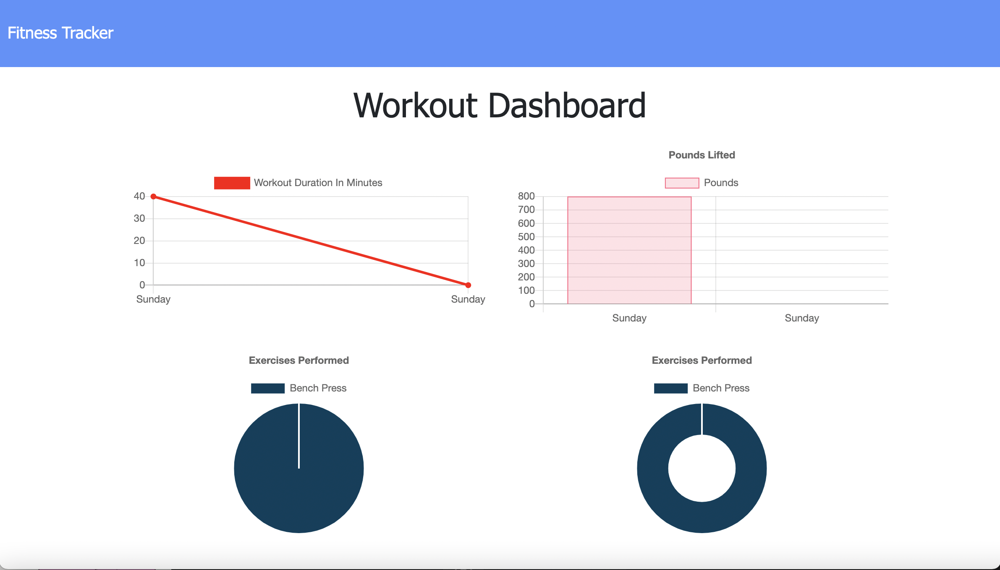
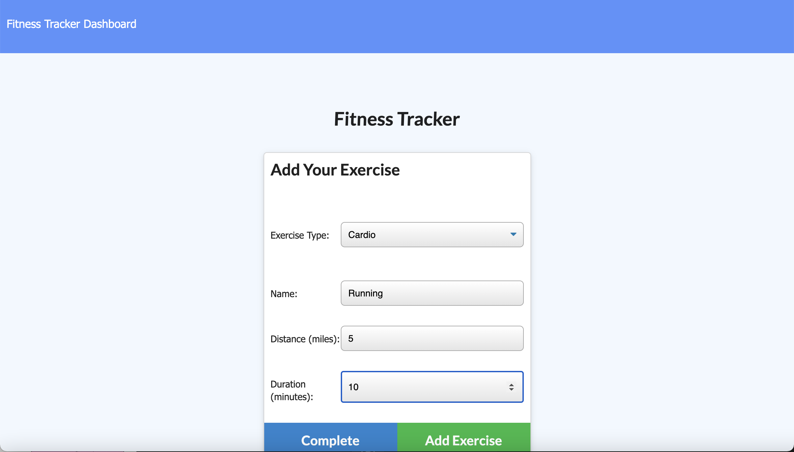
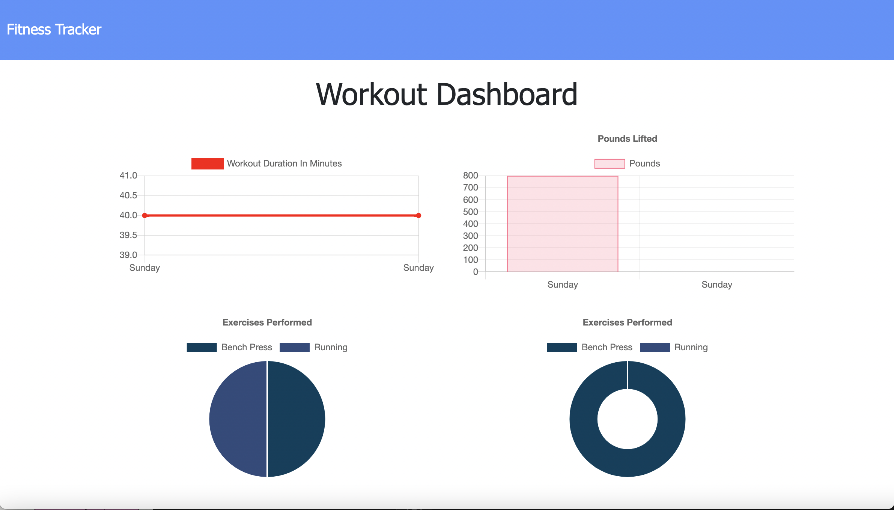

# Fitness-Tracker
An app with the ability to view, create, and track daily workouts.

## About

This application helps users reach their fitness goals more quickly when they track their workout progress.

## Application

This application allows users to view create and track daily workouts. The user can log multiple exercises in a workout on a given day. Using a mongoDB Atlas Database, one can track the name, type, weight, sets, reps, and duration of exercise. If the exercise is a cardio exercise, I should be able to track my distance traveled.

Features include:

* Add exercises to the most recent workout plan.
* Add new exercises to a new workout plan.
* View the combined weight of multiple exercises from the past seven workouts on the /stats page.
* View the total duration of each workout from the past seven workouts on the stats page.
* The ability to delete employees, departments, and roles.

Link: https://still-everglades-38736.herokuapp.com/

This is the initial view of the Fitness Tracker, before any workout has begun. The user clicks the 'New Workout' button to begin.

Next, the user is brought to a screen with forms to describe the first exercise. In this example, the user is submitting a resistance exercise.

Next, when the user clicks the dashboard button on navigation bar on the top left, the stat page appears. The user will be able to view the recently submitted resistance exercise.

In this following example, the user is submitting the next exercise within the same workout. Here, the user is submitting a cardio exercise. Notice how the criteria is different from the previous resistance exercise.

Finally, after submitting the cardio exercise, the user can click on the dashboard button and view both of the exercises added to the current workout.

## License

MIT License

Copyright (c) 2021 Neil Creveling

Permission is hereby granted, free of charge, to any person obtaining a copy of this software and associated documentation files (the "Software"), to deal in the Software without restriction, including without limitation the rights to use, copy, modify, merge, publish, distribute, sublicense, and/or sell copies of the Software, and to permit persons to whom the Software is furnished to do so, subject to the following conditions:

The above copyright notice and this permission notice shall be included in all copies or substantial portions of the Software.

THE SOFTWARE IS PROVIDED "AS IS", WITHOUT WARRANTY OF ANY KIND, EXPRESS OR IMPLIED, INCLUDING BUT NOT LIMITED TO THE WARRANTIES OF MERCHANTABILITY, FITNESS FOR A PARTICULAR PURPOSE AND NONINFRINGEMENT. IN NO EVENT SHALL THE AUTHORS OR COPYRIGHT HOLDERS BE LIABLE FOR ANY CLAIM, DAMAGES OR OTHER LIABILITY, WHETHER IN AN ACTION OF CONTRACT, TORT OR OTHERWISE, ARISING FROM, OUT OF OR IN CONNECTION WITH THE SOFTWARE OR THE USE OR OTHER DEALINGS IN THE SOFTWARE.
